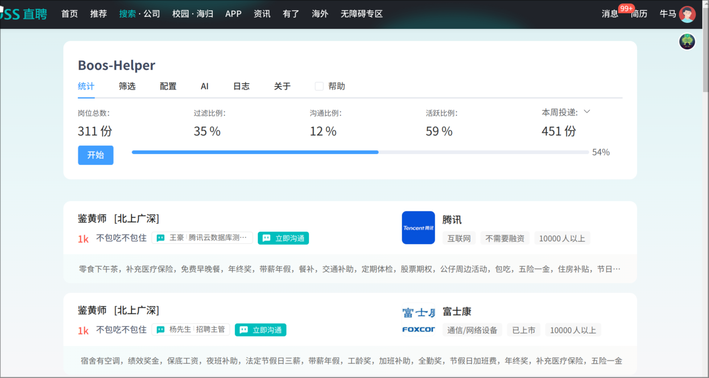
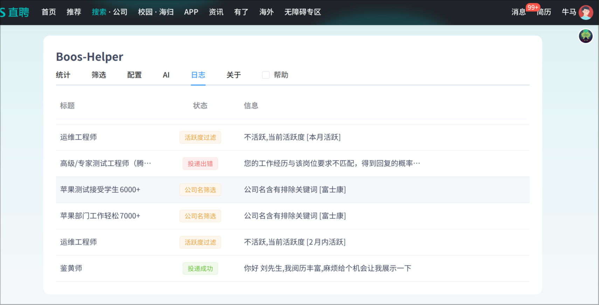

# 免责声明

本项目仅供学习交流，禁止用于商业用途

使用该脚本有一定风险(如黑号,封号,权重降低等)，本项目不承担任何责任

## 项目介绍

Boos直聘助手, 皆在减少投递简历的麻烦, 和提高投递简历的效率,技术栈使用VIte + Vue3 + element-plus, 代码由 Vite 打包无加密混淆最小化,开源在 Github 欢迎前来Pr

> 本项目处于积极维护状态
>
> 测试阶段,目前可以正常筛选,自动打招呼并且进行投递,统计,GPT等功能制作中

## 项目预览

## 版本说明

[x.x.x] 为正式版本,同步github的release版本,不保证稳定性只是功能相对完善

[202x.x.x.alpha] 为测试版本,同步github的master分支,每日自动构建

> 目前正在测试自动编译阶段,一切皆为测试版本

## 未来计划

- [x] 优化UI去除广告
- [x] 批量投递简历
- 高级筛选
  - [x] 薪资,公司名,工作名,人数,内容简单筛选
  - [ ] 通勤时间
  - [ ] 公司风险评控
  - [ ] GPT筛选
- 自动打招呼
  - [x] 模板语言
  - [ ] 支持GPT调用
- GPT赋能
  - [ ] 自动回复聊天
  - [ ] 多模型管理
- 额外功能(有时间会写)
  - [ ] 暗黑模式
  - [ ] 自适应UI适配手机
  - [ ] 黑名单
  - [ ] 多账号管理
  - [ ] 聊天屏蔽已读消息
  - [ ] boos消息弹窗

## 相关链接

Github开源地址: <https://github.com/ocyss/boos-helper>

greasyfork地址: <https://greasyfork.org/zh-CN/scripts/491340>

## 参与贡献

> 本项目写的一托,包括文件名,变量名,不完整的注释,解释不到位的help...,如果有更好的命名,功能解释,文件结构优化方案,请直接提交pr,让你的名字出现到贡献者名单中。

1. Fork 本仓库并克隆到本地。
2. 在新分支上进行您的更改：`git checkout -b 您的分支名称`
3. 提交更改：`git commit -am '描述您的更改'`
4. 推送更改到您的 Fork：`git push origin 您的分支名称`
5. 提交 Pull 请求。

- 在开发时server模式会注入脚本,也可能导致跨域问题请禁用以下两个策略
  
  chrome 用户:

  - chrome://flags/#block-insecure-private-network-requests
  - chrome://flags/#private-network-access-respect-preflight-results

  edge 用户:

  - edge://flags/#block-insecure-private-network-requests
  - edge://flags/#private-network-access-respect-preflight-results

## 鸣谢

- <https://github.com/yangfeng20/boss_batch_push>
- <https://github.com/lisonge/vite-plugin-monkey>

- <https://www.runoob.com/manual/mqtt/protocol/MQTT-3.1.1-CN.pdf>
  
## 类似项目

- <https://github.com/Frrrrrrrrank/auto_job__find__chatgpt__rpa>
- <https://github.com/noBaldAaa/find-job>

## 最后

嗯...
