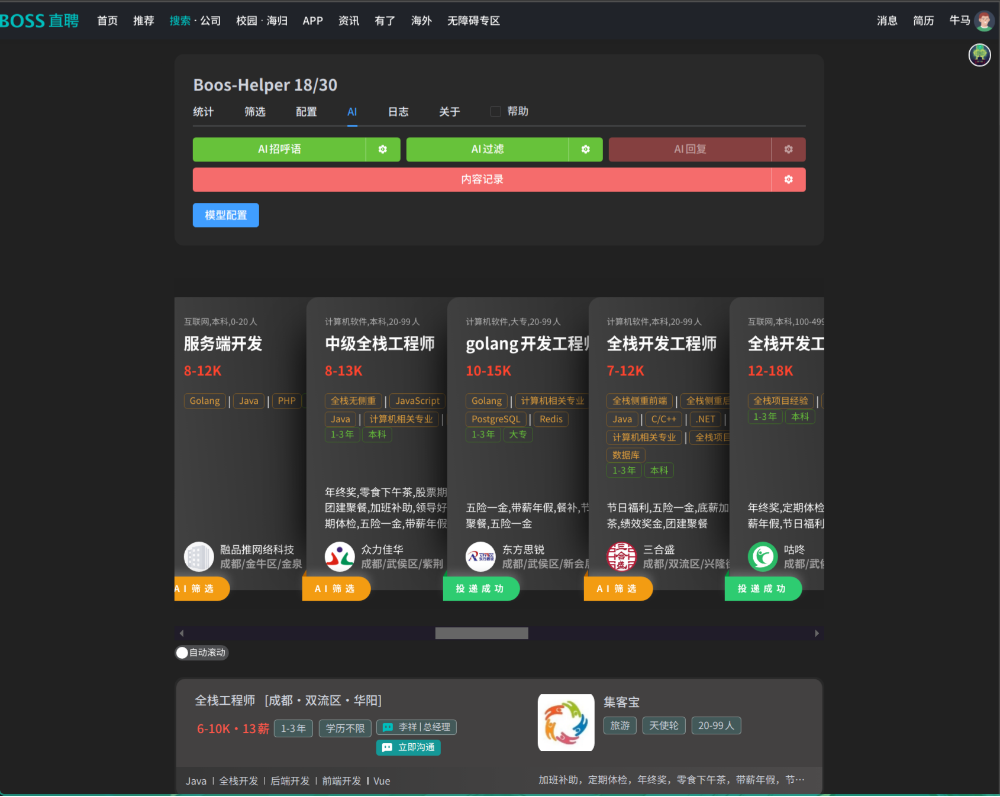
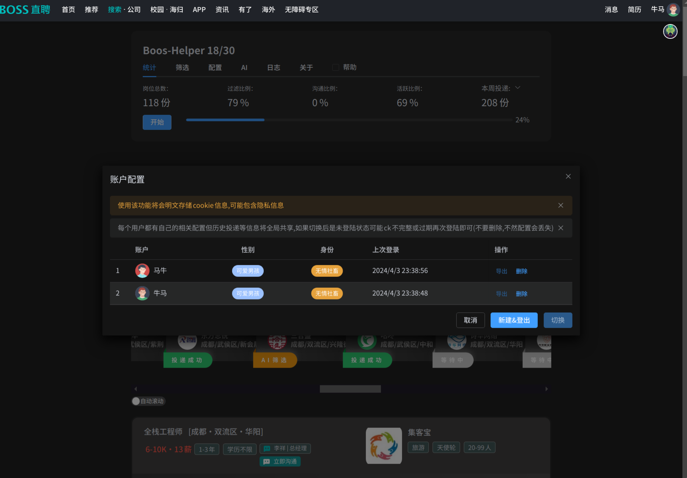

> [!CAUTION] 免责声明
> 本项目仅供学习交流，禁止用于商业用途
>
> 使用该脚本有一定风险(如黑号,封号,权重降低等)，本项目不承担任何责任

## 项目介绍
Boss直聘助手, 皆在减少投递简历的麻烦, 和提高投递简历的效率, 技术栈使用WXT + Vue3 + element-plus, 开源在 Github 欢迎前来Pr

> 本项目处于积极维护状态, 一直很忙所以拖了比较久才开源，抱歉了~

## 相关链接

Github开源地址: <https://github.com/ocyss/boos-helper>

飞书反馈问卷(匿名): <https://gai06vrtbc0.feishu.cn/share/base/form/shrcnmEq2fxH9hM44hqEnoeaj8g>

> 每个提交都会给我发通知，我看见就会评论的形式回复 一般 1-2天

飞书问卷结果: <https://gai06vrtbc0.feishu.cn/share/base/view/shrcnrg8D0cbLQc89d7Jj7AZgMc>

greasyfork地址(0.2旧版本): <https://greasyfork.org/zh-CN/scripts/491340>

## 项目预览

## TODO

- [x] 优化UI去除广告
- [x] 批量投递简历
- 高级筛选
  - [x] 薪资,公司名,工作名,人数,内容简单筛选
  - 公司地址相关 
    > 使用高德api，需要自行申请，或者使用关键字筛选, 暂时只有驾车和步行
    - [x] 驾车/步行距离
    - [x] 驾车/步行时间
  - [ ] 公司风险评控
  - [x] AI筛选
- 自动打招呼
  - [x] 模板语言
  - [x] 支持chatGPT
- AI赋能
  - [ ] 自动回复聊天
  - [x] 多模型管理
- 额外功能(有时间会写)
  - [ ] 暗黑模式 （停更中~）
  - [x] 自适应UI适配手机
  - [ ] 黑名单
  - [x] 多账号管理
  - [ ] 聊天屏蔽已读消息
  - [ ] boss消息弹窗

## 参与贡献

1. Fork 本仓库并克隆到本地。
2. 在新分支上进行您的更改：`git checkout -b 您的分支名称`
3. 提交更改：`git commit -am '描述您的更改'`
4. 推送更改到您的 Fork：`git push origin 您的分支名称`
5. 提交 Pull 请求。

## 鸣谢

- <https://github.com/yangfeng20/boss_batch_push>
- <https://github.com/lisonge/vite-plugin-monkey>
- <https://github.com/chatanywhere/GPT_API_free>

- <https://uiverse.io/>
- <https://www.runoob.com/manual/mqtt/protocol/MQTT-3.1.1-CN.pdf>

## 类似项目

- <https://github.com/Frrrrrrrrank/auto_job__find__chatgpt__rpa>
- <https://github.com/noBaldAaa/find-job>

## 最后

嗯...

## Star 趋势

<a href="https://star-history.com/#ocyss/boos-helper&Date">
 <picture>
   <source media="(prefers-color-scheme: dark)" srcset="https://api.star-history.com/svg?repos=ocyss/boos-helper&type=Date&theme=dark" />
   <source media="(prefers-color-scheme: light)" srcset="https://api.star-history.com/svg?repos=ocyss/boos-helper&type=Date" />
   
 </picture>
</a>
